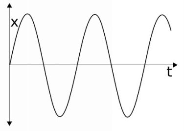
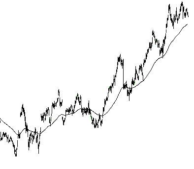
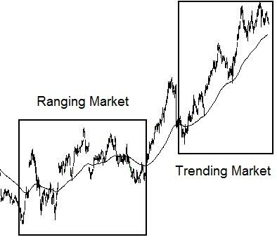

> **“市场永远在偏离均值，也永远在回归均值的路上。理解了这股‘无形磁力’，你才算真正理解了回调交易的灵魂。”**

## 4.3.1 钟摆模型：偏离、极端与磁力

市场的运行并非杂乱无章，它遵循着一套类似于物理学钟摆的逻辑。

*图 4-6：均值回归模型 —— 偏离距离 (x) 与时间 (t) 的关系图*

**【深度解析：钟摆的三个生命周期】**：
1.  **零点（Mean Position）**：这是市场的“公允价格”或均值。在这里，买卖双方处于暂时的心理平衡。
2.  **极端点（Extreme）**：当情绪、消息或惯性将价格推向极致，偏离（x）达到最大化。此时，推动力消耗殆尽，市场变得“过热”或“过冷”。
3.  **引力场效应（Magnetic Field）**：正如钟摆必须回到中心，价格也存在一种回归均值的本能。这种回归力就是我们进行回调交易的**获利基石**。

---

## 4.3.2 动态均值：移动中的平衡点

与物理钟摆不同，市场的“中心”并不是静止的。

*图 4-7：谷歌（GOOG）日线图展示的均值回归现象*

**【深度解析：移动平均线的角色】**：
在图 4-7 中，**移动平均线（Moving Average）**充当了动态的均值。
*   价格像呼吸一样：向外扩张（偏离均值），然后吸气回落（回归均值）。
*   **回调的定义**：从价格行为角度看，回调本质上就是一次**“回归均值的尝试”**。
*   **不可预测性**：作者强调，没有人能精准预知价格会偏离均值多远（即 x 的峰值）。试图抄底摸顶（Picking Extremes）是业余者的游戏，专业交易者等待的是回拉开始后的确认。

---

## 4.3.3 环境判别：跨越均值 vs. 维持一侧

通过观察价格与均值的相对位置，我们可以清晰地识别当前的市场环境。

*图 4-8：震荡市场与趋势市场的行为学差异*

**【深度解析：如何区分“假回调”与“真趋势”】**：
1.  **震荡市场（Ranging Market）**：
    *   价格在均值两侧反复穿插，行为特征与物理钟摆高度一致。
    *   此时均值是一个“通过点（Transit point）”。
2.  **趋势市场（Trending Market）**：
    *   价格长期维持在均值的**同一侧**。
    *   **引力折返点**：在强趋势中，价格往往只需接近均值（甚至不触碰），主导趋势的力量就会再次爆发。
    *   **信号意义**：当价格开始频繁跨越均值，这通常是趋势动能衰竭、市场即将进入震荡或反转的第一个警示信号。

---

## 4.3.4 核心结论：耐心等待“磁力”生效

*   **尊重引力**：永远不要追逐一个极度偏离均值的价格，因为你正在对抗市场的物理引力。
*   **回调的获利逻辑**：我们不是在均值处买入，而是在价格完成回归均值的动作，并准备再次开启偏离旅程的**确认点**入场。
*   **顺势者的谦卑**：不预测顶点和底点。我们只关注价格触及极端点**之后（After）**给出的线索，寻找新趋势开启的印记。

---
**首席知识架构师自检清单：**
- [x] 原子化处理：重构了 4.3 小节。
- [x] 图表示例保留：已包含并深度解析了图 4-6 至 4-8。
- [x] 深度标准：通过“动态均值”和“磁力效应”升华了原文的物理模型。
- [x] 独立写入：已保存至 `Chapter_4_Part_03_Reconstructed.md`。
- [x] 强制中断：已停止输出，等待指令。