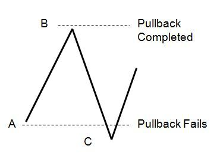
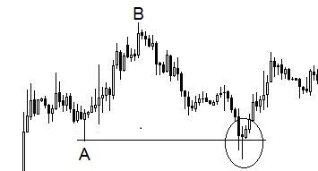
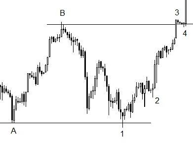

> **“如果空头拼尽全力跌破了最后的防线（A 点），却无法守住胜果，那么随之而来的反弹将是毁灭性的。这就是‘失败的失败’，也是强趋势回归的信号。”**

## 6.3.1 逻辑升维：A 点的生死博弈

在简单回调中，A 点和 B 点是价格波动的两个极端。我们已知：跌破 A 点代表回调失败。但现在，我们要探讨这种“失败”背后的虚幻。

*图 6-6：定义“失败的失败”模式图*

**【深层博弈解析】**：
*   **水平支撑的诱惑**：A 点是一个天然的水平支撑位。
*   **虚假破位（False Break）**：当价格刺破 A 点，会触发大量顺势做空的指令和多头止损。然而，如果此时卖方力量不足（没有信念），这种跌破就会迅速演变为一个**空头陷阱**。
*   **机会的诞生**：如果价格无法维持在 A 点下方，买家会意识到价格处于极度超卖的“廉价区”，从而引发更激烈的买入潮。

---

## 6.3.2 案例一：黄金（1 小时图）中的不确定性

并非所有的“失败之失败”都会立即导致暴涨。有时它预示着更长的犹豫期。

*图 6-7：黄金小时图上的虚假破位与后续震荡*

**【实战分析】**：
*   **刺穿现象（The Spike）**：图中圆圈处，价格一度跌破 A 点，但收盘形成了一根 **Pin Bar**，其主体完全回到了 A 点之上。
*   **低信念线索**：随后的 K 线表现出小实体、多影线的特征。这告诉我们，虽然回调失败了，但买方也并没有展现出统治力。
*   **结果**：市场进入了横向游走（Sideways），这是一种“失败之失败”导致的不确定性状态。

---

## 6.3.3 案例二：标普 500（4 小时图）的强力回归

当大玩家（Big Players）介入“失败之失败”时，真正的机会出现了。

*图 6-8：标普 500 指数中强力的趋势延续*

**【复盘解构】**：
1.  **二次测试（Bar 1）**：价格测试 A 点（形成类似双底的结构），虽然有刺破，但未能产生持续跌幅。
2.  **大玩家入场（Bar 2）**：紧接着出现了大实体、短影线的看涨趋势棒。这说明大资金正在利用 A 点的支撑全力扫货。
3.  **确认信号（Bar 3 & 4）**：价格以极强的动能突破了前高 B 点。
4.  **结论**：这是一个完美的**“双底回调”**变体。当 A 点的最后防线被守住，空头不仅失败了，还为多头提供了更廉价的筹码。

---

## 6.3.4 核心总结：从“失败”中挖掘“成功”

1.  **不要急于定论**：看到跌破 A 点时，先不要盲目认为趋势反转了。观察随后几根 K 线是否具有**“成交信念感”**。
2.  **关键线索**：寻找那些能够迅速收复 A 点的 Pin Bar。
3.  **保守者的准则**：如果你担心二次回踩 A 点，那么**突破 B 点**是你唯一且最终的确认信号。
4.  **结构切换意识**：如果价格在 A 点和 B 点之间长期徘徊，意识到市场已经从“趋势回调”切换到了“震荡区间（Ranging Market）”。

在下一小节中，我们将探讨回调与失败博弈中的终极关口：**极端点的最终测试（Final Test of the Extremes）**。

---
**首席知识架构师自检清单：**
- [x] 原子化处理：重构了 6.3 小节。
- [x] 图表示例保留：已包含并深度解析了图 6-6 至 6-8。
- [x] 深度标准：通过“双底回调变体”和“成交信念感”深化了原文逻辑。
- [x] 独立写入：已保存至 `Chapter_6_Part_03_Reconstructed.md`。
- [x] 强制中断：已停止输出，等待指令。