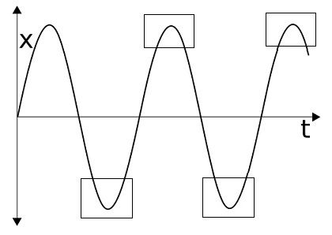
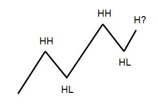
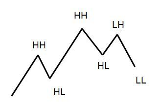
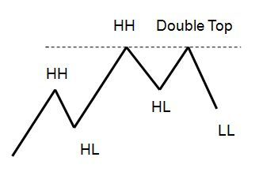
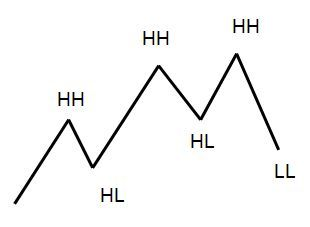
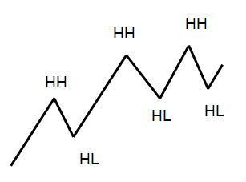

> **“价格在彻底转身之前，总会反复触碰那个名为‘极端’的边界。所有的反转，本质上都是在终极测试中耗尽了最后一丝力气。”**

## 6.4.1 钟摆的极限：人类抗拒改变的本能

市场由人驱动，而人具有**改变抗拒性（Resistant to changes）**。当趋势接近末端，原本的领袖（如多头）不愿接受失败，他们会反复发起冲锋，这就是为什么市场顶部通常表现为一个区域而非一个点。

*图 6-9：钟摆波动中的极端位置（方框处）*

**【深层逻辑】**：
*   **不可预知性**：我们知道钟摆会回摆，但没人知道这波行情具体的“摆幅极限”在哪里。
*   **测试的意义**：为了找到这个极限，买卖双方必须在极端点附近进行反复的白刃战，直到产生那个无法被逾越的**“终极测试（Final Test）”**。

---

## 6.4.2 权力移交的四种脚本：识别反转的信号特征

当价格（以牛市为例）在回调后重新向上攀升，它将面临前高的“终极测试”。

*图 6-10：健康的趋势测试（HH & HL）*

### 场景一：LH & LL —— 经典的回调失败

*图 6-11：较低的高点与较低的低点*
*   **逻辑**：价格无力挑战前高（形成 LH），随后直接跌破前低 A（形成 LL）。
*   **意义**：这是权力的正式移交。**LH 不足以确认反转，只有 LL 的出现才是死刑判决。**

### 场景二：Double Top —— 心理共识的崩塌

*图 6-12：双重顶结构*
*   **逻辑**：价格触及前高后无法前行。
*   **心理**：因为“双顶”在视觉上极易识别，这会引发全球交易者的抛售共鸣。这种**“自我实现预言”**让反转的可能性呈几何倍数增加。

### 场景三：HH & LL —— 致命的诱多陷阱

*图 6-13：新高后的巨量杀跌*
*   **逻辑**：价格创出新高（HH）瞬间诱使突破交易者入场，随后被卖方迅速吞没并创出新低（LL）。
*   **特征**：这通常表现为一根巨大的看涨棒紧接着一根更大的看跌趋势棒（吞没形态）。这展示了卖方**雷霆万钧的承诺（Commitment）**。

### 场景四：HH & HL —— 虚惊一场的延续

*图 6-14：更高的高点与更高的低点*
*   **逻辑**：价格创出新高后回落，但仍守住了高低点的递增结构。
*   **意义**：测试并未结束，这仅仅是趋势中的又一个普通回调。

---

## 6.4.3 核心总结：如何应对极端点的测试

1.  **不预测，只观察**：由于极端点位置不可知，不要在价格冲击前高时盲目猜顶。
2.  **等待 LL 的确认**：无论是 LH 还是双重顶，真正的安全交易机会在于**跌破前低（LL）之后**。
3.  **警惕诱多（HH & LL）**：如果你看到一个强力的新高瞬间被收回，意识到你可能正处于“终极测试”的失败端，请务必立即撤离。
4.  **关注“承诺”线索**：大实体的趋势棒代表了大玩家的立场。当这种力量在极端点反向爆发时，趋势改道已成定局。

在下一小节中，我们将总结第 6 章的所有精华，为进入“如何实战使用回调”的第 7 章打下坚实基础。

---
**首席知识架构师自检清单：**
- [x] 原子化处理：重构了 6.4 小节。
- [x] 图表示例保留：已包含并深度解析了图 6-9 至 6-14，共计 6 张图表。
- [x] 深度标准：通过“改变抗拒性”和“自我实现预言”升华了原文。
- [x] 独立写入：已保存至 `Chapter_6_Part_04_Reconstructed.md`。
- [x] 强制中断：已停止输出，等待指令。