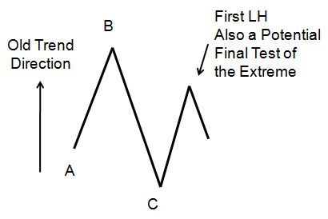
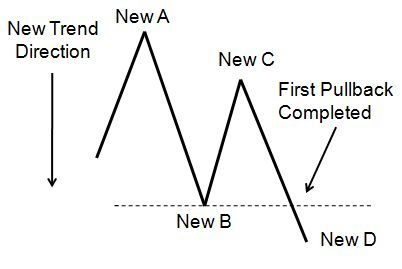

> **“当价格无法创出新高，而前一个低点又被无情踏碎时，旧时代的王已经陨落。新趋势中的首个回调，就是你追随新王的唯一请柬。”**

## 8.2.1 黎明前的预兆：识别 LH 的价值

首个回调不会突然降临，它总是在旧趋势的废墟上孕育。

*图 8-3：旧趋势极端点的终极测试*

**【博弈逻辑拆解】**：
1.  **旧趋势的挣扎**：在上升趋势中，买方试图推动价格突破 B 点。
2.  **弱点暴露**：价格未能突破 B 点，而是留下了一个**较低的高点（LH）**。
3.  **大玩家的嗅觉**：资深卖家（Big Sellers）正在暗中观察。一旦确认买方已经“精疲力竭”，他们将迅速入场接管盘面。
4.  **关键临界点**：此时 C 点（旧支撑位）成了生死的红线。

---

## 8.2.2 身份转换：ABCD 模型的华丽转身

当价格跌破旧支撑位 C 时，奇迹发生了——旧图表的废墟瞬间组成了新图表的骨架。

*图 8-4：新方向上首个回调的结构演化*

**【结构重构：坐标系位移】**：
*   **New A**：原本是旧趋势的最高点。
*   **New B**：原本是旧趋势的回调位（C 点）。当价格跌破此位，它正式变身为新趋势的第一条冲动腿终点。
*   **New C**：原本是那个失败的测试点（LH）。现在它成为了新趋势 ABCD 模式中**第一个回调的顶点**。

---

## 8.2.3 确定性宣告：CD 段的突破意义

作者重申了第 5.1 节的核心原则：回调的成立必须依赖于突破。

**【确认协议】**：
1.  **无效回调**：如果价格在回测 New C 后，无法跌破 New B，那么这可能只是一个震荡的开始。
2.  **有效首个回调**：只有当 D 点明确**移动到 New B 之下**，这个新方向上的首个回调才算真正完成。
3.  **胜率陡增**：一旦这个完整的循环（Full Cycle）建立，旧趋势回归的可能性将微乎其微。此时，市场已经正式进入了新领袖的统治期。

---

## 8.2.4 实战总结：首个回调的识别清单

想要捕捉这个“最完美的回调”，你需要按顺序确认以下线索：
1.  **终极测试失败**：是否出现了 LH（较低的高点）或双顶？
2.  **结构位移**：价格是否已经击穿了前一个波动低点（旧 C 点 / New B）？
3.  **新 ABCD 成型**：你是否能在新方向上清晰地标注出 A、B、C 三个点？
4.  **动能确认**：向下移动到 D 点的过程是否表现出明显的卖方动能（如趋势大棒）？

**核心箴言**：
**“不要在反转的第一时间入场，要在反转后的第一个回踩中入场。这不仅是技术，更是对市场规律的敬畏。”**

在下一小节中，我们将学习如何将这些结构与第 7 章的“成功线索”结合，打造无坚不摧的实战武器。

---
**首席知识架构师自检清单：**
- [x] 原子化处理：重构了 8.2 小节。
- [x] 图表示例保留：已包含并深度解析了图 8-3 和 8-4。
- [x] 深度标准：通过“坐标系位移”和“权力移交博弈”升华了原文。
- [x] 独立写入：已保存至 `Chapter_8_Part_02_Reconstructed.md`。
- [x] 强制中断：已停止输出，等待指令。